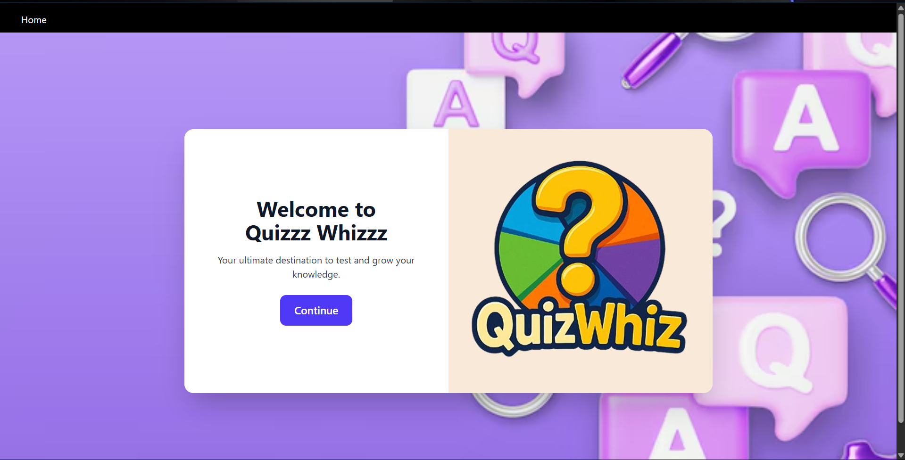
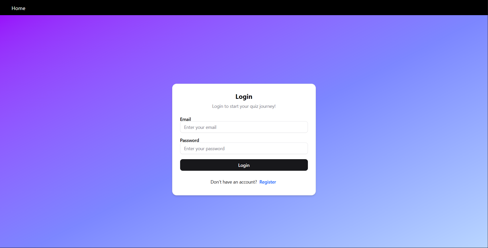
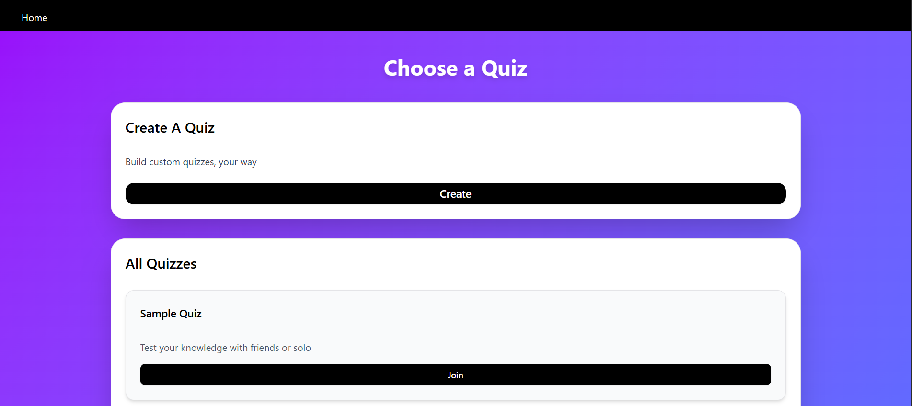

# 🎯 Quizz Whizzz

**Quizz Whizzz** is a full-stack quiz application built with the MERN stack.  
It allows users to register, log in, create quizzes, and attempt quizzes in real-time.  
The app features an intuitive UI, dynamic quiz handling, and secure backend API integration.

---

🚀 Features
✅ User Authentication – Register & log in securely with JWT
✅ Create Quizzes – Add quiz name, questions, options & correct answers ✏️
✅ Attempt Quizzes – Join quizzes & answer questions interactively 📝
✅ Real-Time Score Calculation – Get instant results 📊
✅ Responsive Design – Mobile, tablet & desktop friendly 📱💻
✅ Modern UI – Built using ShadCN UI & TailwindCSS 🎨
---

## 🛠 Tech Stack

### **Frontend**
- React + TypeScript
- TailwindCSS
- ShadCN UI
- Zod (Form validation)
- React Hook Form
- Zustand (State management)
- React Router DOM

### **Backend**
- Node.js + Express.js
- MongoDB + Mongoose
- JWT Authentication
- bcrypt for password hashing

## 📸 Screenshots

|Home Page| Login Page | Register Page | Dashboard |
||  ||   |

