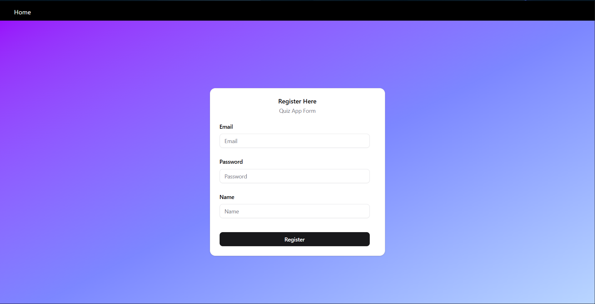

# 🎯 Quizz Whizzz 🧠✨

**Quizz Whizzz** is a full-stack quiz application built with the **MERN stack** 🎉 
It allows users to **register**, **log in**, **create quizzes**, and **attempt quizzes in real time** ⏱️.  
Featuring an **intuitive UI**, **dynamic quiz handling**, and **secure backend API integration** 🔐.

---

## 🚀 Features

✅ **User Authentication** – Register & log in securely with **JWT**  
✅ **Create Quizzes** – Add quiz name, questions, options & correct answers ✏️  
✅ **Attempt Quizzes** – Join quizzes & answer questions interactively 📝 
✅ **Real-Time Score Calculation** – Get instant results 📊  
✅ **Responsive Design** – Mobile, tablet & desktop friendly 📱💻  
✅ **Modern UI** – Built using **ShadCN UI** & **TailwindCSS** 🎨 

---

## 🛠 Tech Stack

### 💻 Frontend
- ⚛️ **React + TypeScript**  
- 🎨 **TailwindCSS**  
- 🪄 **ShadCN UI**  
- 🛡 **Zod** (Form validation)  
- 📋 **React Hook Form**  
- 📦 **Zustand** (State management)  
- 🛣 **React Router DOM**  

### 🖥 Backend
- 🟢 **Node.js + Express.js**  
- 🍃 **MongoDB + Mongoose**  
- 🔑 **JWT Authentication**  
- 🔒 **bcrypt** for password hashing  

---

## 📸 Screenshots

|Home Page || Login Page |  | Register Page || Dashboard |   |

